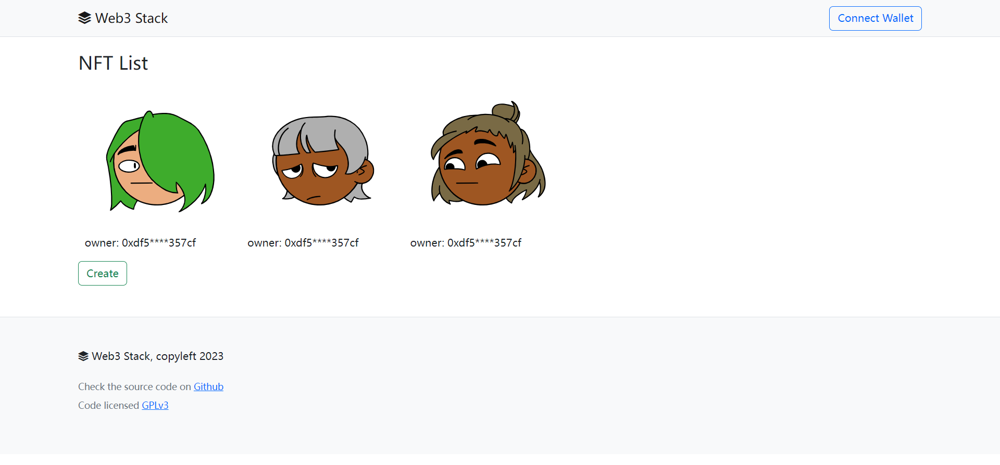
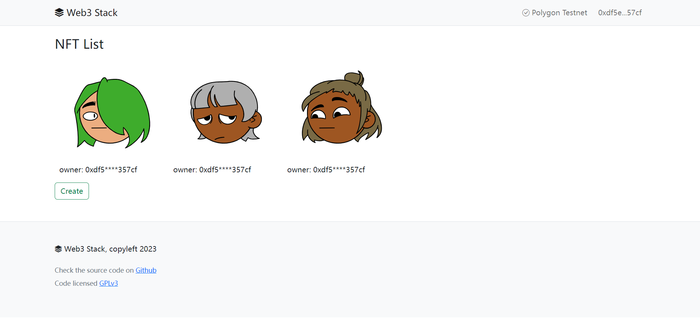
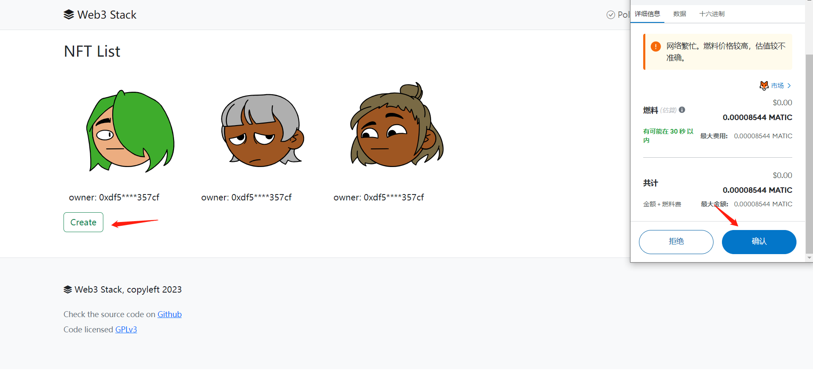

# Sample Hardhat Project

This project demonstrates a basic Hardhat use case. It comes with a sample contract, a test for that contract, and a script that deploys that contract.

Try running some of the following tasks:

## install hardhat

```shell
npx hardhat help
npx hardhat compile
# npx hardhat test
# REPORT_GAS=true npx hardhat test
# npx hardhat node
npx hardhat run scripts/deploy-card.js
```

## install graph

```shell
npm install -g @graphprotocol/graph-cli

graph init --product hosted-service ywdlucking/web3stack \
--from-contract 0x1aA78C54bEd78a36C012B19c2F68FE41643199Df \
--network mumbai
--abi /home/ywd/workspace/node/web3stack/abi/Card.json


graph auth --product hosted-service

graph deploy --product hosted-service ywdlucking/web3stack
```

configureation nginx,add set the root index page is ./index.html

visit websit: http://localhost/web3stack






